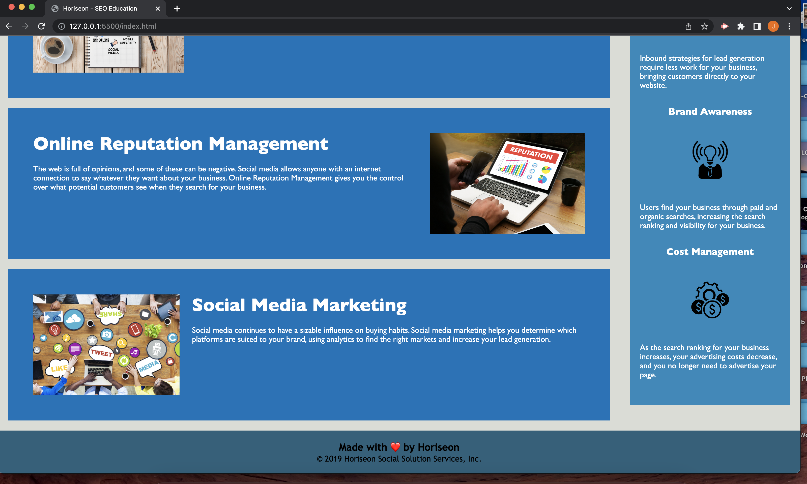

# Challenge #1: Horiseon-refractor

This is a repo to hold refractory code for Horiseon making the website more accessible to web browsers on smaller devices. 

## Description

- The motivation behind the project was to be able to implement some of the new skills I have developed as a beginner coder so that I can practice meeting accessibility standards. 
- I modified this project to practice refractoring. In doing so, I was able to allow the website to be more accessible, ensuring that people with disabilities can access the website and still be able to navigate the site and gain the same information as other individuals navigating the site. Additionally I was able to ensure all bugs in the code were fixed.
- Modifying this code addressed the websites link bug associated with the SEO nav link. Additionally, it solved the websites lack of accessibility to those not capable of seeing the images on the page and knowing how they compliment the page. 
- In modifying this project, I learned how to address semantic structure more appropriately than I did before and improved some of my naming conventions for coding. 

## Installation

"N/A"

## Usage

### Fullsized Screenshot Top and Bottom
md
    
    

### Reduced Window Size Screenshot
md
    

## Credits

Starter code belongs to © 2022 edX Boot Camps LLC. Confidential and Proprietary. All Rights Reserved.

## License

MIT License

Copyright (c) 2022 jerrybeau89

Permission is hereby granted, free of charge, to any person obtaining a copy
of this software and associated documentation files (the "Software"), to deal
in the Software without restriction, including without limitation the rights
to use, copy, modify, merge, publish, distribute, sublicense, and/or sell
copies of the Software, and to permit persons to whom the Software is
furnished to do so, subject to the following conditions:

The above copyright notice and this permission notice shall be included in all
copies or substantial portions of the Software.

THE SOFTWARE IS PROVIDED "AS IS", WITHOUT WARRANTY OF ANY KIND, EXPRESS OR
IMPLIED, INCLUDING BUT NOT LIMITED TO THE WARRANTIES OF MERCHANTABILITY,
FITNESS FOR A PARTICULAR PURPOSE AND NONINFRINGEMENT. IN NO EVENT SHALL THE
AUTHORS OR COPYRIGHT HOLDERS BE LIABLE FOR ANY CLAIM, DAMAGES OR OTHER
LIABILITY, WHETHER IN AN ACTION OF CONTRACT, TORT OR OTHERWISE, ARISING FROM,
OUT OF OR IN CONNECTION WITH THE SOFTWARE OR THE USE OR OTHER DEALINGS IN THE
SOFTWARE.

## Features

Navigation links to direct you to the section topic on the webpage.
